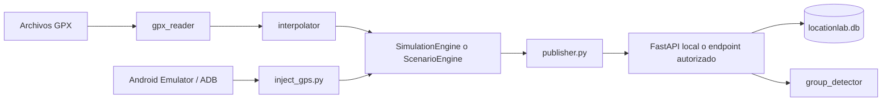

# LocationLab - Project Context for LLMs

**Fecha de referencia:** 2026-08-05
**Estado:** PoC funcional en Python; no es todavia un producto de produccion.
**Repositorio Git:** rama `main`, remoto `origin` configurado y cambios publicados hasta el commit `b65a5ab`.

## 1. Instrucciones para un LLM

Este documento es el contexto principal del proyecto. Antes de modificar codigo:

1. Trata la implementacion Python descrita en este documento como la fuente de verdad actual.
2. Trata `deep-research-report_8279.md` como investigacion y arquitectura futura, no como descripcion exacta del codigo existente.
3. No migres a .NET, Azure ni otra tecnologia salvo que el usuario lo pida expresamente.
4. Mantén el alcance en pruebas autorizadas sobre sistemas propios o con consentimiento explicito.
5. No uses, inventes ni guardes tokens, cookies, contrasenas o credenciales reales.
6. Preserva los cambios locales del usuario y evita refactors no relacionados.
7. Para cambios de comportamiento, añade o actualiza tests y ejecuta la validacion mas estrecha disponible.
8. Usa rutas relativas desde la raiz del proyecto en configuraciones y comandos.

## 2. Objetivo del proyecto

LocationLab es un laboratorio de pruebas para simular multiples dispositivos Android que emiten eventos de localizacion GPS durante rutas predefinidas.

El caso de uso principal es un escenario de carpooling:

- Un conductor recorre una ruta completa.
- Varios pasajeros se desplazan inicialmente a pie hasta puntos de recogida.
- Tras la recogida, sus rutas convergen con la del conductor.
- Cada dispositivo emite posicion, hora, velocidad, rumbo y precision.
- El sistema puede detectar que varios dispositivos viajan juntos.

El objetivo tecnico es validar, en un entorno autorizado, como un backend o una aplicacion propia procesa y distingue telemetria GPS sintetica, sin necesidad de levantar un emulador Android completo por cada dispositivo logico.

El proyecto no pretende ser una aplicacion final de movilidad ni una herramienta para manipular servicios de terceros. La prueba debe ejecutarse contra una API propia, un entorno de staging o una aplicacion para la que exista autorizacion.

## 3. Estado actual y alcance

### Implementado

- Modelos compartidos con Pydantic.
- Calculo de distancia Haversine.
- Calculo de bearing inicial.
- Ruido gaussiano de posicion.
- Lectura de rutas GPX con `gpxpy`.
- Interpolacion lineal por tiempo.
- Motor generico de N dispositivos sobre una ruta comun.
- Motor de escenarios con una ruta por dispositivo.
- Simulacion de carpooling Bilbao/Lemoa -> Mondragon.
- Publicacion HTTP individual o por lotes con `httpx`.
- API FastAPI local.
- Persistencia SQLite con `sqlite3` nativo.
- Detector de grupos por proximidad, desfase temporal, velocidad y persistencia.
- Scripts de creacion y lanzamiento de AVDs.
- Inyeccion de posiciones via ADB.
- Captura de screenshot y jerarquia UI para exploracion de login.
- Tests unitarios, de regresion e integracion para geo, interpolacion, GPX,
  escenarios, publicacion HTTP, API, SQLite y detector de grupos.
- Validacion manual del escenario de carpooling y health check de la API.

### No implementado o no resuelto

- Autenticacion propia de la API local.
- Sistema de usuarios o permisos.
- Dashboard web.
- Dashboard web.
- Procesamiento distribuido o multi-worker coherente.
- Retencion y limpieza automatica de datos SQLite.
- Autenticacion y observabilidad para entornos no locales.
- Infraestructura cloud o despliegue Azure.
- Garantia de compatibilidad con una API de terceros.

La retencion SQL ya dispone de `cleanup_database.py`: ofrece `--dry-run`,
elimina eventos y grupos antiguos en una transaccion y respeta
`LOCATIONLAB_DB_PATH`. La limpieza de ficheros se limita por ahora a caches y
datos runtime; los scripts Android se conservan porque siguen formando parte
del flujo opcional de validacion.

La suite actual tiene 40 tests pasando. El CLI admite `wall_tick_seconds` para
acelerar el tiempo de pared sin alterar el tiempo simulado. El escenario
`scenarios/commute_bilbao_smoke.json` recorre la ventana completa en segundos;
no modifica `scenarios/commute_bilbao.json`.

El repositorio incluye `.github/workflows/ci.yml`, que ejecuta la suite,
compilacion y comprobacion de whitespace en cada push a `main` y pull request.

## 4. Estructura del proyecto

```text
Route_sim_2026/
├── PROJECT_CONTEXT.md          # Este documento, contexto principal para LLMs
├── README.md                   # Guia breve actual
├── deep-research-report_8279.md# Investigacion y arquitectura futura propuesta
├── requirements.txt            # Dependencias Python
├── simulator_config.json       # Configuracion del simulador generico
├── emulator_config.json        # Mapeo entre ADB y dispositivos del escenario
├── scenarios/
│   ├── commute_bilbao.json       # Escenario principal de carpooling
│   └── commute_bilbao_smoke.json # Smoke acelerado del escenario principal
├── routes/
│   ├── commute_driver.gpx
│   ├── commute_passenger1.gpx
│   ├── commute_passenger2.gpx
│   ├── commute_passenger3.gpx
│   └── sample-route.gpx
├── locationlab/
│   ├── core/
│   │   ├── models.py           # Modelos Pydantic de dominio
│   │   ├── geo.py              # Distancia, bearing y ruido
│   │   └── group_detector.py   # Detector de grupos con persistencia
│   ├── api/
│   │   ├── main.py             # Aplicacion FastAPI y endpoints
│   │   └── database.py         # Persistencia SQLite
│   └── simulator/
│       ├── gpx_reader.py       # Lector GPX
│       ├── interpolator.py     # Interpolacion temporal
│       ├── engine.py            # Simulador generico de N dispositivos
│       ├── scenario.py          # Motor de rutas individuales
│       ├── publisher.py         # Cliente HTTP
│       ├── main.py              # CLI generica del simulador
│       └── scenario_main.py     # CLI de escenarios
├── tests/
│   ├── test_geo.py
│   ├── test_group_detector.py
│   ├── test_interpolator.py
│   ├── test_gpx_reader.py
│   └── test_pipeline_regressions.py
├── create_avds.py              # Crea archivos AVD manualmente en Windows
├── setup_avds.ps1              # Preparacion de AVDs
├── launch_emulators.ps1        # Lanzamiento de emuladores
├── write_launch_script.py      # Generacion de scripts de lanzamiento
├── inject_gps.py               # Inyeccion GPS via ADB
├── run_demo.py                 # Demo visual del carpooling
├── validate_scenario.py        # Validacion manual del escenario
├── probe_login.py              # Sonda de pantalla/UI via ADB
└── show_results.py             # Consulta/visualizacion de resultados
```

Los archivos generados localmente `locationlab.db`, `.pytest_cache`, capturas y otros artefactos no forman parte del codigo fuente conceptual.

## 5. Arquitectura actual



### Capas

#### `locationlab.core`

Contiene la logica de dominio que no depende de HTTP, SQLite ni ADB.

- `models.py`: `LocationEvent`, `LocationEventBatch`, `GroupInfo` y `DeviceInfo`.
- `geo.py`: `haversine_meters`, `bearing_degrees` y `add_noise_meters`.
- `group_detector.py`: detector basado en componentes conexas y persistencia por tick.

#### `locationlab.simulator`

Genera eventos sinteticos a partir de GPX.

- `gpx_reader.py` carga y normaliza rutas.
- `interpolator.py` obtiene posicion, velocidad y rumbo para un instante.
- `engine.py` replica una ruta para N dispositivos con jitter y ruido.
- `scenario.py` asigna un GPX independiente a cada dispositivo.
- `publisher.py` publica eventos por HTTP.
- `scenario_main.py` ejecuta un escenario JSON durante su ventana temporal.

#### `locationlab.api`

API de validacion local.

- `main.py` declara endpoints y coordina persistencia/deteccion.
- `database.py` inicializa SQLite y ejecuta lecturas/escrituras.
- La base de datos por defecto es `locationlab.db` en la raiz.

#### Scripts de Android

- `create_avds.py` escribe manualmente los `.ini` de cuatro AVDs.
- `launch_emulators.ps1` arranca los emuladores.
- `inject_gps.py` busca emuladores ADB y ejecuta `adb emu geo fix` en paralelo.
- `probe_login.py` comprueba el dispositivo, instala APK opcional, abre un package y guarda screenshot/UI XML.

## 6. Flujo funcional

### Simulador hacia la API

1. `scenario_main.py` carga `scenarios/commute_bilbao.json`.
2. Se crean varios `DeviceScenarioConfig`.
3. `ScenarioEngine.initialize()` lee un GPX por dispositivo.
4. El reloj de simulacion empieza en la ruta mas temprana.
5. En cada tick, `get_events()` interpola cada ruta.
6. Se aplica ruido de posicion y variacion de velocidad.
7. `ApiPublisher` envia un batch a `/api/locations/batch`.
8. FastAPI valida el payload con Pydantic.
9. SQLite guarda los eventos.
10. La API obtiene muestras recientes y ejecuta `GroupDetector`.
11. Los grupos consolidados se guardan en `detected_groups`.
12. Los endpoints de dispositivos y grupos permiten consultar resultados.

### Inyeccion en emuladores Android

1. Se carga el mismo escenario.
2. Se comprueba la lista de dispositivos conectados con `adb devices`.
3. `emulator_config.json` relaciona cada serial con un `device_id`.
4. En cada tick, el motor genera eventos.
5. Solo los dispositivos con emulador activo se seleccionan.
6. Se ejecuta `adb -s SERIAL emu geo fix LONGITUDE LATITUDE ALTITUDE` en paralelo.
7. La pantalla del emulador/app recibe la ubicacion sintetica.

## 7. API actual

### `GET /health`

Devuelve estado y timestamp del servidor.

### `POST /api/locations`

Acepta un `LocationEvent` individual. Devuelve `202` con el id insertado.

### `POST /api/locations/batch`

Acepta `{ "events": [...] }`. Rechaza lotes vacios y devuelve el numero insertado.

### `GET /api/devices`

Devuelve el ultimo evento y el recuento total por dispositivo.

### `GET /api/devices/{device_id}/locations?limit=100`

Devuelve el historial del dispositivo. `limit` esta restringido entre 1 y 1000.

### `GET /api/groups/current`

Devuelve grupos guardados en SQLite cuya ultima actividad esta dentro de la ventana actual. La identidad se estabiliza por el conjunto canonico de dispositivos para evitar duplicados por tick.

Swagger esta disponible cuando se arranca la API en `http://localhost:8080/docs`.

## 9. Ejecucion recomendada

La ruta principal de la PoC es HTTP local: API, simulador y SQLite pueden
ejecutarse en el mismo equipo. Los dispositivos son objetos logicos Python;
no es necesario iniciar un emulador Android por cada dispositivo.

```powershell
# Terminal 1
python -m uvicorn locationlab.api.main:app --reload --port 8080

# Terminal 2
python validate_scenario.py
python -m locationlab.simulator.scenario_main --scenario scenarios/commute_bilbao.json
```

Antes de ejecutar:

```powershell
python -m pytest -q
python -m compileall -q locationlab
```

Para una ejecucion acelerada, usa `scenarios/commute_bilbao_smoke.json`.
Tambien puedes definir `wall_tick_seconds` en cualquier escenario; si se
omite, conserva el mismo valor que `tick_seconds`.

La validacion Android es opcional y se reserva para smoke tests de una app
propia o de staging autorizado. Se recomienda empezar con un unico AVD o un
dispositivo fisico; cuatro AVDs requieren mas CPU y memoria y no sustituyen
la simulacion HTTP de carga.

## 8. Modelo de datos

### `LocationEvent`

Campos principales:

- `device_id`: identificador no vacio.
- `latitude`: rango -90..90.
- `longitude`: rango -180..180.
- `timestamp_utc`: instante de simulacion o del evento.
- `accuracy_meters`: precision declarada.
- `speed_meters_per_second`: velocidad.
- `bearing_degrees`: rumbo.

### Tablas SQLite

`location_events` contiene:

- `id`
- `device_id`
- coordenadas
- `timestamp_utc`
- precision, velocidad y rumbo
- `received_utc`

`detected_groups` contiene:

- `group_id`
- lista separada por comas de `device_ids`
- `detected_at`
- `member_count`

## 9. Configuracion

### Escenario `scenarios/commute_bilbao.json`

Incluye:

- URL de API.
- intervalo entre ticks.
- tamano de batch.
- endpoint batch o individual.
- duracion maxima.
- cabeceras adicionales.
- lista de dispositivos y GPX.

Los campos `Authorization` y `X-Auth-Token` del escenario estan vacios por defecto. No guardar credenciales reales en JSON ni en Git.

### Simulador generico `simulator_config.json`

Controla ruta comun, numero de dispositivos, jitter inicial, ruido, variacion de velocidad y cabeceras.

### AVD `create_avds.py`

Esta orientado a Windows y presupone:

- SDK en `C:\Android\Sdk`.
- Imagen `android-30/google_apis_playstore/x86_64`.
- AVDs en `%USERPROFILE%\\.android\\avd`.

Puede requerir adaptar `SDK_ROOT`, la imagen instalada, RAM, GPU y el path del SDK local.

## 10. Instalacion y ejecucion

Usar el entorno virtual del proyecto en Windows:

```powershell
.\.venv\Scripts\Activate.ps1
python -m pip install -r requirements.txt
```

Arrancar API:

```powershell
python -m uvicorn locationlab.api.main:app --reload --port 8080
```

Ejecutar escenario:

```powershell
python -m locationlab.simulator.scenario_main --scenario scenarios/commute_bilbao.json
```

Ejecutar demo visual:

```powershell
python run_demo.py
python run_demo.py --speed 60
python run_demo.py --no-api
```

Validar manualmente el escenario:

```powershell
python validate_scenario.py
```

Ejecutar tests:

```powershell
python -m pytest -q
```

Comprobar compilacion:

```powershell
python -m compileall -q locationlab
```

Abrir documentacion API:

```text
http://localhost:8080/docs
```

## 11. Infraestructura local

La infraestructura actual es local y deliberadamente sencilla:

- Windows como host principal.
- Python y un entorno virtual `.venv`.
- FastAPI/Uvicorn para la API.
- SQLite como persistencia.
- Archivos GPX como fuente de rutas.
- Android SDK/ADB opcional.
- Hasta cuatro AVDs configurados por scripts.
- Sin Docker, Azure, Kubernetes, CI/CD ni servicios externos obligatorios.

### Perfil recomendado de uso

Para probar muchos dispositivos logicos no es necesario lanzar muchos emuladores. El simulador Python puede producir muchos eventos con bajo coste. Usar cero o un emulador Android para validacion visual reduce notablemente el consumo de CPU y RAM.

## 12. Detector de grupos

`GroupDetector` compara muestras por pares y une dispositivos cuando cumplen:

- distancia maxima: 30 metros por defecto;
- desfase temporal maximo: 10 segundos;
- diferencia de velocidad maxima: 2 m/s;
- persistencia minima: 3 ticks.

El detector calcula componentes conexas. Por tanto, un grupo puede formarse transitivamente: A puede estar cerca de B y B cerca de C aunque A y C superen individualmente la distancia maxima.

El estado del detector vive en memoria dentro del proceso FastAPI. No esta preparado para varios workers sin un mecanismo compartido de estado.

## 13. Riesgos y problemas conocidos

### Prioridad media

1. **Detector en memoria por proceso.**
   Con varios workers, cada proceso acumula persistencia de forma independiente.

2. **Persistencia sin politica de limpieza.**
   `location_events` y `detected_groups` crecen indefinidamente.

### Prioridad baja

3. **Scripts de AVD especificos de una maquina.**
   Las rutas del SDK y la imagen Android estan fijadas a un entorno Windows concreto.

4. **Uso de cabeceras que imitan un cliente Android.**
   Solo debe utilizarse contra sistemas propios o autorizados y con datos de prueba.

## 14. Tests y validacion

### Cobertura actual

- `tests/test_geo.py`: Haversine, bearing y ruido.
- `tests/test_group_detector.py`: distancia, desfase, persistencia, separacion y ruido.
- `tests/test_interpolator.py`: puntos inicial/final, midpoint, velocidad, bearing y offsets.
- `tests/test_pipeline_regressions.py`: persistencia temporal, grupos estables, validacion de escenarios y reintentos HTTP.

### Huecos de cobertura

Quedan como ampliaciones:

- tests de `load_gpx()` con GPX vacio, sin timestamps, timestamps mixtos y timezone;
- tests de `LocationEvent` y batch;
- `tests/test_gpx_reader.py`: timestamps UTC, rutas sin fecha y timestamps mixtos.
- `tests/test_gpx_reader.py`: `ScenarioEngine` con rutas independientes por dispositivo.

La integracion basica de FastAPI ya esta cubierta en `tests/test_pipeline_regressions.py`:
ingesta batch, historial de dispositivo y consolidacion de grupos.

La suite muestra avisos de deprecacion pendientes: migrar `on_event` a lifespan y
revisar la compatibilidad futura de `TestClient` con `httpx`.

El entorno global de Python no tenia `pytest` disponible en una validacion previa. El proyecto contiene `.venv`; la comprobacion correcta debe realizarse con el interprete del entorno virtual.

## 15. Plan de evolucion

### Fase 0 - Reproducibilidad

- Inicializar Git.
- Crear `.gitignore` para `.venv`, `.pytest_cache`, `__pycache__`, `locationlab.db`, logs y artefactos sensibles.
- Verificar instalacion con `.venv`.
- Ejecutar tests y guardar el resultado.
- Mantener `PROJECT_CONTEXT.md` actualizado.

### Fase 1 - Corregir el nucleo funcional

- Definir formalmente si el tiempo de deteccion es simulado o de recepcion.
- Corregir la consulta de muestras recientes.
- Diseñar identidad y ciclo de vida de grupos.
- Evitar inserciones duplicadas.
- Corregir GPX parcialmente fechado.
- Validar configuracion antes de arrancar.

### Fase 2 - Calidad de pruebas

- Añadir tests de integracion API/SQLite.
- Añadir tests del publisher y de errores HTTP.
- Añadir tests con rutas reales de `routes/`.
- Añadir una prueba end-to-end local: simulador -> API -> consulta de resultados.

### Fase 3 - Operacion local

- Añadir logging estructurado y metricas basicas.
- Añadir limpieza/retencion de SQLite.
- Hacer configurable la ruta de la base de datos.
- Separar configuracion publica de secretos.
- Mejorar scripts de ADB y diagnostico de emuladores.

### Fase 4 - Escalado opcional

Solo si el objetivo lo requiere:

- Sustituir SQLite por PostgreSQL.
- Mover el detector a un servicio con estado compartido.
- Añadir cola de eventos o procesamiento por lotes.
- Containerizar API y simulador.
- Evaluar despliegue cloud.

La migracion a .NET descrita en `deep-research-report_8279.md` es una alternativa futura, no una tarea implicita. Primero debe estabilizarse el comportamiento del PoC actual y demostrar que la migracion aporta valor.

## 16. Decisiones tecnicas actuales

- Python 3.x en lugar de .NET.
- FastAPI para la API local.
- Pydantic v2 para validacion de modelos.
- SQLite nativo para evitar infraestructura adicional.
- `gpxpy` para leer GPX.
- `httpx` para publicar eventos.
- Rutas por tiempo, no por distancia recorrida en tiempo real.
- Ruido y variacion aleatorios; la reproducibilidad completa aun no esta centralizada mediante una seed.
- Estado del detector en memoria y resultados en SQLite.

## 17. Criterios de aceptacion de una ejecucion local

Una ejecucion se considera valida cuando:

1. La API responde `200` en `/health`.
2. El escenario carga todos los GPX sin excepciones.
3. El simulador publica batches y recibe respuestas `202`.
4. `GET /api/devices` muestra todos los dispositivos esperados.
5. El historial contiene coordenadas, tiempos y velocidades coherentes.
6. La dispersion durante los tramos compartidos es compatible con el ruido configurado.
7. El detector consolida grupos despues de la persistencia configurada.
8. No se mezclan credenciales reales con configuracion o artefactos.
9. Los tests pasan usando el `.venv` del proyecto.

## 18. Resumen para iniciar una tarea

Antes de tocar codigo, identifica:

- que modulo es propietario del comportamiento;
- si el cambio afecta al tiempo simulado, al tiempo de recepcion o a ambos;
- si hay que actualizar tests y documentacion;
- si el escenario usa rutas historicas o generadas en tiempo real;
- si la tarea es para la PoC Python actual o para la arquitectura futura .NET.

La respuesta corta para cualquier nuevo colaborador es: **LocationLab simula telemetria GPS multi-dispositivo a partir de GPX, la publica en una API local, persiste los eventos y prueba la deteccion de grupos, todo en un entorno local autorizado.**
