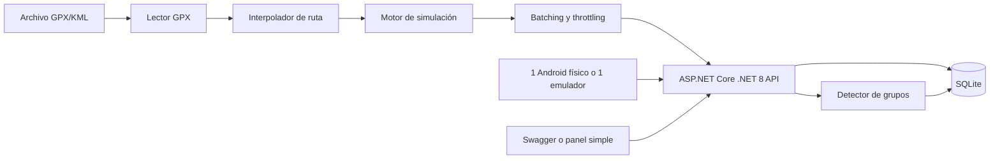
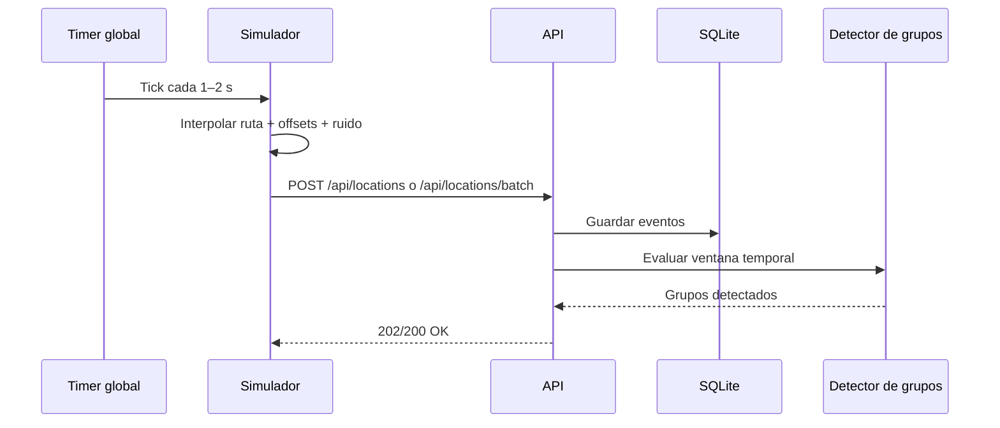

# Laboratorio ligero para simular la ubicación de muchos Android que viajan juntos

## Resumen ejecutivo

La conclusión principal es bastante clara: **en un portátil con CPU antigua y RAM justa, no conviene intentar levantar muchos emuladores Android completos**. Tanto el Android Emulator oficial como Genymotion Desktop parten de requisitos relativamente altos, con 16 GB de RAM como referencia práctica para trabajar con emulación, virtualización obligatoria y, en el caso de Genymotion, requisitos explícitos de GPU y un coste adicional por cada dispositivo virtual. Android Studio incluso avisa de que, si no alcanzas esas especificaciones, puede ser mejor probar con un dispositivo físico. citeturn8view1turn10view1turn9view0turn9view2

Para ese contexto, la arquitectura que mejor encaja no es “muchos Android”, sino **un laboratorio híbrido**: una **API ligera en ASP.NET Core**, un **simulador .NET** que genera decenas de dispositivos virtuales como procesos/objetos ligeros, **SQLite** para persistencia local, y **solo un Android real o un único emulador** para validar la app de prueba y el comportamiento visual. Esa aproximación evita el cuello de botella de CPU y memoria que introduce la virtualización múltiple, pero mantiene casi todo el valor técnico: ingestión de telemetría, reproducción de rutas GPX, interpolación, ruido controlado, sincronización temporal y detección de grupos. La base técnica encaja bien con `Worker Service`, `IHostedService`, `PeriodicTimer`, `System.Threading.Channels` e `IHttpClientFactory` en .NET. citeturn11view0turn8view3turn11view1turn17search4turn17search9

Mi recomendación concreta es esta: **usa .NET 8 para la PoC si quieres fijar el stack**, pero con una nota importante: **.NET 8 sigue soportado a fecha de 12 de julio de 2026, aunque está en fase de mantenimiento y termina soporte el 10 de noviembre de 2026**. Si el laboratorio va a vivir más allá de la PoC, merece la pena dejar muy fácil la migración a .NET 10, que es la LTS actual. citeturn24view0turn24view1

También conviene separar bien el alcance: este informe está orientado a **aprendizaje, testing y validación de arquitectura**, no a manipular aplicaciones de terceros, ni a eludir sistemas de recompensa, ni a falsear actividad real. Por eso la propuesta se centra en una **app de pruebas propia**, rutas GPX tuyas y un backend tuyo. Esa separación no es un detalle menor: técnicamente, te permite probar justo lo difícil sin tocar nada ajeno.  

## Objetivos y requisitos

### Objetivos funcionales del laboratorio

El laboratorio debería cubrir cinco objetivos funcionales. Primero, **reproducir una misma ruta GPX o KML para múltiples dispositivos virtuales** con parámetros individuales por dispositivo. Segundo, **sincronizar dispositivos para que “viajen juntos”** dentro de umbrales configurables de distancia y tiempo. Tercero, **persistir la telemetría** para poder recalcular distancias, ventanas temporales y agrupaciones. Cuarto, **permitir una validación visual mínima** con un único Android físico o un solo emulador. Quinto, **ser reproducible desde Visual Studio con ayuda de GitHub Copilot**, usando plantillas estándar de .NET y documentación automática de la API. Android Emulator y Genymotion soportan reproducción de rutas GPX/KML; ASP.NET Core y los Worker Services proporcionan la base para la ingesta y la simulación; y GitHub Copilot en Visual Studio está pensado justo para acelerar tareas rutinarias como generar tests, depurar y completar código contextual. citeturn10view0turn8view2turn11view0turn8view3turn8view5turn11view8

### Requisitos mínimos y recomendados

La tabla siguiente mezcla **requisitos oficiales** de las herramientas pesadas con una **estimación práctica** para el laboratorio propuesto. La idea no es decir “esto es lo que pide el fabricante” para la arquitectura ligera, sino traducir esos requisitos oficiales a una configuración realista para un portátil viejo.

| Perfil | CPU | RAM | Disco | Recomendación |
|---|---|---:|---:|---|
| **Mínimo viable estimado para el laboratorio propuesto** | 4 hilos con virtualización activada si usas 1 emulador | 8 GB | 20–30 GB SSD | API + simulador + SQLite + **0 o 1** emulador. Si el emulador va inestable, cambia a **móvil físico** para la parte Android. Android Emulator y Genymotion piden bastante más para ir cómodos. citeturn8view1turn10view1turn9view0 |
| **Recomendado para trabajar cómodo** | 6–8 hilos modernos | 16 GB | 50 GB SSD | Encaja mejor con lo que Google y Genymotion consideran una experiencia razonable de emulación local. citeturn8view1turn10view1turn9view0 |
| **No recomendable** | CPU pre-2017 muy justa + varios emuladores | 8 GB o menos | HDD | Mala combinación para virtualización múltiple; además Android Studio recomienda microarquitectura posterior a 2017 en Windows/Linux y Genymotion pide 16 GB de RAM y GPU OpenGL 3.3+. citeturn8view1turn9view0turn9view3 |

A nivel de software, la combinación más sensata es **Visual Studio con la carga de trabajo de ASP.NET y desarrollo web**, **.NET SDK 8**, **SQLite**, y **Android Studio solo si realmente vas a usar un emulador**. La plantilla `Worker Service` está disponible tanto en Visual Studio como en la CLI; `dotnet new` instala plantillas integradas; y Visual Studio 17.10 o posterior ya trae GitHub Copilot y Copilot Chat integrados. citeturn25view3turn25view0turn11view8

### Comparativa de opciones de ejecución

| Opción | Lo que aporta | Lo que penaliza | Veredicto para portátil viejo |
|---|---|---|---|
| **Android Emulator** | Viene con Android Studio; permite fijar ubicación, crear y reproducir rutas, importar GPX/KML y usar comandos `geo fix` desde la consola del emulador. citeturn10view0turn20search0turn10view1 | Google recomienda 16 GB RAM y virtualización; con hardware corto puede ir poco fluido. citeturn10view1turn8view1 | **Sí, pero solo una instancia** para smoke tests. |
| **Genymotion Desktop** | Soporta rutas GPX/KML, automatización vía Genymotion Shell y comandos GPS detallados. citeturn8view2turn19view0 | Requiere 16 GB RAM o más, OpenGL 3.3+, virtualización y tiene coste por VM/dispositivo virtual. citeturn9view0turn9view2 | **Útil si ya lo conoces**, pero tampoco lo usaría para 20–100 instancias. |
| **Dispositivo físico + simulador .NET** | Quita casi toda la carga de virtualización del host; Android Docs sugieren valorar dispositivo físico si no llegas a las especificaciones del emulador. citeturn10view1 | No replica un Android virtual completo para cada dispositivo; solo la parte móvil real/visible. | **La mejor opción práctica** si el portátil va justo. |

## Arquitectura detallada

La arquitectura recomendada es deliberadamente asimétrica: **muchos dispositivos lógicos, muy pocos dispositivos Android reales/emulados**. Esa asimetría es la que hace viable el laboratorio en CPU limitada. La razón es simple: cada AVD es un dispositivo aislado con su propio almacenamiento y comportamiento de máquina virtual, y Genymotion añade además sobrecarga por hypervisor y recursos gráficos. En cambio, un `Worker Service` de .NET puede simular cientos de estados de dispositivo con objetos en memoria y una única cadencia de reloj. citeturn10view1turn9view0turn9view2turn11view0turn8view3



La pieza central es la **API HTTP**, no el emulador. Ahí entran los eventos de ubicación, se validan, se persisten y se calculan las agrupaciones. Para un proyecto nuevo y ligero, las **Minimal APIs** son la opción más limpia: Microsoft las describe como el enfoque recomendado para construir APIs HTTP rápidas con ASP.NET Core. En .NET 8 puedes mantener esa filosofía aunque uses una plantilla Web API clásica; lo importante es que el host sea pequeño y directo. citeturn2search5turn25view2

En cuanto a documentación de la API, hay un matiz importante. **La compatibilidad OpenAPI integrada como “built-in” en ASP.NET Core se documenta a partir de .NET 9**, mientras que para **ASP.NET Core 8** la documentación oficial sigue cubriendo Swashbuckle/NSwag como camino normal para Swagger/OpenAPI. Si tu objetivo es net8.0 hoy, yo montaría **Swashbuckle** y dejaría `Microsoft.AspNetCore.OpenApi` como una mejora para futura migración. citeturn8view4turn7search1turn7search14

También conviene asumir desde el diseño que **.NET 8 está cerca de fin de soporte**. No es un problema para una PoC en julio de 2026, pero sí una razón para separar bien dominios y dependencias: `Core`, `Api`, `Simulator` y `Tests`. Así, el salto a .NET 10 después será principalmente de target framework y paquetes, no de arquitectura. citeturn24view0turn24view1



## Diseño de la API

### Estructura propuesta

La API debería ser pequeña, explícita y muy fácil de probar desde Swagger y desde el simulador. Una propuesta razonable sería esta:

| Endpoint | Método | Propósito |
|---|---|---|
| `/api/locations` | `POST` | Ingesta de un único evento de localización |
| `/api/locations/batch` | `POST` | Ingesta por lotes para reducir coste por request |
| `/api/devices` | `GET` | Listado de dispositivos conocidos |
| `/api/devices/{deviceId}/locations` | `GET` | Histórico o ventana reciente de un dispositivo |
| `/api/groups/current` | `GET` | Grupos detectados en la ventana activa |
| `/api/routes/{routeId}` | `GET` | Metadatos de una ruta cargada |
| `/health` | `GET` | Health check básico |

Para un backend local pequeño, **SQLite con EF Core** es la opción con mejor relación entre simplicidad y utilidad: el proveedor está mantenido dentro del propio proyecto EF Core. Si más adelante quieres consultas espaciales más serias, puedes pasar a PostgreSQL con Npgsql y, si hace falta, tipos espaciales con NetTopologySuite. EF Core expone explícitamente ese soporte espacial con NTS. citeturn11view3turn8view6turn11view5

La decisión de modelo importa si eliges SQLite. La documentación de Microsoft avisa de limitaciones relevantes con `DateTimeOffset` y `decimal` en consultas más allá de igualdad/lectura-escritura; por eso, para esta PoC, tiene sentido guardar **UTC en `DateTime`** y usar **`double`** para coordenadas, precisión y velocidades. citeturn23view0

### Modelo `LocationEvent`

```csharp
public sealed record LocationEvent(
    string DeviceId,
    double Latitude,
    double Longitude,
    DateTime TimestampUtc,
    double AccuracyMeters,
    double SpeedMetersPerSecond,
    double BearingDegrees
);
```

Ese modelo es deliberadamente corto: contiene lo mínimo para reproducir distancia, tiempo, velocidad y orientación. Para SQLite es mejor usar `DateTime` UTC y `double`, justo por las limitaciones comentadas arriba. citeturn23view0

### Ejemplo JSON de `POST /api/locations`

```json
{
  "deviceId": "dev-020",
  "latitude": 43.262985,
  "longitude": -2.935013,
  "timestampUtc": "2026-07-12T10:15:30Z",
  "accuracyMeters": 6.5,
  "speedMetersPerSecond": 1.38,
  "bearingDegrees": 92.0
}
```

### Ejemplo de endpoint `POST /api/locations`

```csharp
app.MapPost("/api/locations", async (
    LocationEvent dto,
    LabDbContext db,
    CancellationToken ct) =>
{
    var errors = new Dictionary<string, string[]>();

    if (string.IsNullOrWhiteSpace(dto.DeviceId))
        errors["deviceId"] = ["deviceId es obligatorio."];

    if (dto.Latitude is < -90 or > 90)
        errors["latitude"] = ["La latitud debe estar entre -90 y 90."];

    if (dto.Longitude is < -180 or > 180)
        errors["longitude"] = ["La longitud debe estar entre -180 y 180."];

    if (errors.Count > 0)
        return Results.ValidationProblem(errors);

    db.LocationEvents.Add(new LocationEventEntity
    {
        DeviceId = dto.DeviceId,
        Latitude = dto.Latitude,
        Longitude = dto.Longitude,
        TimestampUtc = dto.TimestampUtc,
        AccuracyMeters = dto.AccuracyMeters,
        SpeedMetersPerSecond = dto.SpeedMetersPerSecond,
        BearingDegrees = dto.BearingDegrees
    });

    await db.SaveChangesAsync(ct);

    return Results.Accepted($"/api/devices/{dto.DeviceId}/locations");
})
.WithName("PostLocation");
```

Las Minimal APIs encajan muy bien con este tipo de endpoint directo, y para .NET 8 puedes documentarlas con Swashbuckle; si migras el proyecto más adelante, ASP.NET Core ya tiene camino oficial hacia OpenAPI integrado a partir de .NET 9. citeturn2search5turn7search1turn8view4

## Diseño del simulador y escalado

### Diseño del simulador

El simulador debería ser un **`Worker Service`** con cuatro capas internas: lector GPX, interpolador, motor de estado por dispositivo y publicador HTTP. Microsoft documenta `Worker Service` como plantilla estándar en Visual Studio y en la CLI, y los servicios hospedados como patrón nativo para tareas en segundo plano. Para marcar los ticks, `PeriodicTimer` es una pieza especialmente apropiada porque está pensada justo para esperar tics de temporizador de forma asíncrona. citeturn8view3turn11view0turn11view1

El comportamiento por ruta debería ser este:

1. Leer puntos GPX ordenados por tiempo si el archivo trae timestamps.
2. Si no los trae, asignar intervalos sintéticos constantes.
3. Interpolar linealmente entre puntos para obtener una posición en cada tick.
4. Aplicar a cada dispositivo un pequeño desfase temporal inicial, un ruido espacial pequeño y, opcionalmente, una ligera variación de velocidad.
5. Emitir eventos hacia la API en lotes.

Ese diseño además se alinea con el comportamiento documentado por Genymotion: acepta GPX/KML, ordena datos si no están cronológicamente, y cuando faltan timestamps usa por defecto el punto anterior + 1 segundo. Android Emulator también soporta importación GPX/KML y control de velocidad de reproducción. citeturn8view2turn10view0

### Parámetros por dispositivo

Un bloque de configuración útil sería este:

```json
{
  "Simulation": {
    "RouteFile": "routes/sample-route.gpx",
    "DeviceCount": 50,
    "TickMilliseconds": 1000,
    "BatchSize": 20,
    "StartDelayJitterMs": 1500,
    "PositionNoiseMeters": 4.0,
    "SpeedVariationPercent": 2.0,
    "UseBatchEndpoint": true
  }
}
```

La clave no es “hacer que todos sean idénticos”, sino que estén **suficientemente correlacionados** para que el detector los identifique como un grupo, sin crear duplicados matemáticamente perfectos. En una PoC suele bastar con ruido gaussiano muy pequeño, un `start delay` bajo y velocidad con variación del ±1–3 %.

### Ejemplo de `BackgroundService` para simular N dispositivos

```csharp
public sealed class RouteSimulationWorker : BackgroundService
{
    private readonly SimulationEngine _engine;
    private readonly ApiPublisher _publisher;
    private readonly SimulationOptions _options;

    public RouteSimulationWorker(
        SimulationEngine engine,
        ApiPublisher publisher,
        IOptions<SimulationOptions> options)
    {
        _engine = engine;
        _publisher = publisher;
        _options = options.Value;
    }

    protected override async Task ExecuteAsync(CancellationToken stoppingToken)
    {
        using var timer = new PeriodicTimer(
            TimeSpan.FromMilliseconds(_options.TickMilliseconds));

        while (await timer.WaitForNextTickAsync(stoppingToken))
        {
            foreach (var batch in _engine.GetNextEvents().Chunk(_options.BatchSize))
            {
                if (_options.UseBatchEndpoint)
                    await _publisher.SendBatchAsync(batch, stoppingToken);
                else
                    foreach (var item in batch)
                        await _publisher.SendAsync(item, stoppingToken);
            }
        }
    }
}
```

La base técnica de ese patrón es oficial: `BackgroundService`/`IHostedService` para trabajos de larga duración, `PeriodicTimer` para ticks asíncronos, `Channels` para desacoplar productores/consumidores cuando quieras refinar la canalización, e `IHttpClientFactory` para gestionar clientes HTTP de forma limpia. citeturn11view0turn11view1turn17search4turn17search9

### Estrategia de sincronización y escalado en CPU limitada

Aquí está la parte realmente importante. En un portátil justo, la estrategia no puede ser “un `Task` muy activo por dispositivo” si apuntas a 50 o 100 dispositivos. La estrategia razonable es:

| Técnica | Qué hace | Cuándo usarla |
|---|---|---|
| **Reloj global** | Un único tick marca el avance de todos los dispositivos | Siempre |
| **Batching** | Agrupa 10–25 eventos por envío | Desde 20 dispositivos |
| **Throttling** | Limita la frecuencia de publicación | Si el backend empieza a acumular latencia |
| **Channels** | Cola asíncrona productor/consumidor | Cuando quieras desacoplar cálculo y red |
| **Endpoint batch** | Reduce overhead HTTP por evento | Muy recomendable para 50–100 dispositivos |

Si necesitas proteger la API, ASP.NET Core también ofrece middleware oficial de rate limiting. Y si el simulador llama a la API por HTTP, `IHttpClientFactory` te deja centralizar configuración, logging y ciclo de vida del cliente. citeturn17search5turn17search9turn17search18

Para que se vea por qué este enfoque escala aceptablemente en CPU vieja, basta un cálculo sencillo. Con detección naïve por parejas, el número de comparaciones por tick es:

| Dispositivos | Comparaciones por tick |
|---:|---:|
| 20 | 190 |
| 50 | 1 225 |
| 100 | 4 950 |

A 1 tick por segundo, esas cifras siguen siendo perfectamente manejables para una PoC en .NET si no metes varias VMs Android encima. Mi recomendación práctica sería:

- **20 dispositivos**: tick de 1 s, sin batch o batch pequeño.
- **50 dispositivos**: tick de 1 s, batch de 20.
- **100 dispositivos**: tick de 1–2 s, batch de 20–25, y persistencia asíncrona.

### Comparativa de bibliotecas y herramientas GPX

| Opción | Tipo | Ventajas | Inconvenientes | Recomendación |
|---|---|---|---|---|
| **`System.Xml.Serialization.XmlSerializer`** | Biblioteca oficial .NET | Cero dependencia “mágica”, total control del modelo XML, suficiente para GPX 1.1 sencillo. citeturn15search2 | Más trabajo manual; hay que mapear el esquema. | **Muy buena** si quieres entender y controlar todo. |
| **`RolandK.Formats.Gpx`** | Repo GitHub | Librería .NET Standard específica para leer y escribir GPX; basada en `XmlSerializer`. citeturn14search0turn3search8 | Menos ecosistema y comunidad que herramientas GIS más amplias. | **Mi favorita** para PoC si quieres rapidez sin meter mucho peso. |
| **`Aspose.GIS`** | Comercial | Lee, escribe y convierte formatos GIS; más completa. citeturn14search4 | Más pesada y con licencia comercial. | Útil si el laboratorio crece hacia GIS “serio”. |
| **`gpx.studio`** | Herramienta web y repo GitHub | Crear y editar GPX visualmente; muy útil para fabricar rutas de prueba. citeturn18view1 | No es librería .NET. | **Muy recomendable** para generar datasets. |

## Detección de grupos

### Qué algoritmo usar

Para este laboratorio yo no empezaría por DBSCAN. Empezaría por un **algoritmo determinista de reglas**: ventana temporal + distancia máxima + persistencia mínima. El motivo es que, para 20–100 dispositivos y CPU limitada, es más fácil de explicar, depurar y testear. Después, si necesitas una agrupación más flexible cuando el número de grupos varía mucho, sí puedes añadir un paso DBSCAN por “fotograma temporal”. DBSCAN sigue siendo una referencia excelente para clustering espacial: identifica áreas densas, no requiere fijar el número de clusters de antemano y trata los puntos aislados como ruido. citeturn12search0turn12search3turn13search4

Una comparación práctica quedaría así:

| Enfoque | Ventajas | Coste mental | Recomendación |
|---|---|---|---|
| **Reglas + ventana deslizante** | Transparente, muy fácil de testear, suficiente para 20–100 dispositivos | Bajo | **Elección por defecto** |
| **DBSCAN por tick** | Detecta clusters sin fijar cuántos hay y maneja outliers | Medio | Buena segunda fase |
| **Modelo híbrido** | DBSCAN para grupos instantáneos + reglas para persistencia | Alto | Solo si la PoC se queda corta |

### Umbrales iniciales razonables

Como punto de partida:

| Parámetro | Valor base |
|---|---:|
| Distancia máxima entre miembros | 25–35 m |
| Diferencia máxima de timestamp | 5–10 s |
| Persistencia mínima para consolidar grupo | 2–3 min |
| Diferencia máxima de velocidad | 1.5–2.5 m/s |
| Diferencia máxima de bearing | 20–35° |

Esos valores no salen de una norma universal; son una **semilla razonable para pruebas**. Deberías afinarlos con tus propios logs sintéticos. Lo importante es que el detector no se base en un único tick, sino en una persistencia mínima.

### Distancia Haversine

La distancia Haversine es la forma estándar de calcular la distancia angular o de gran círculo entre pares lat/lon sobre una esfera. Para una PoC urbana va sobrada y evita dependencias extra. citeturn12search1

```csharp
public static class Geo
{
    private const double EarthRadiusMeters = 6_371_000.0;

    public static double HaversineMeters(
        double lat1, double lon1,
        double lat2, double lon2)
    {
        double ToRad(double d) => Math.PI * d / 180.0;

        var dLat = ToRad(lat2 - lat1);
        var dLon = ToRad(lon2 - lon1);
        var a =
            Math.Pow(Math.Sin(dLat / 2), 2) +
            Math.Cos(ToRad(lat1)) *
            Math.Cos(ToRad(lat2)) *
            Math.Pow(Math.Sin(dLon / 2), 2);

        var c = 2 * Math.Atan2(Math.Sqrt(a), Math.Sqrt(1 - a));
        return EarthRadiusMeters * c;
    }
}
```

### Detector de grupos sencillo

```csharp
public sealed record Sample(
    string DeviceId,
    double Latitude,
    double Longitude,
    DateTime TimestampUtc,
    double SpeedMetersPerSecond,
    double BearingDegrees);

public static class GroupDetector
{
    public static IReadOnlyList<HashSet<string>> Detect(
        IReadOnlyList<Sample> samples,
        double maxDistanceMeters = 30,
        double maxTimeSkewSeconds = 10)
    {
        var groups = new List<HashSet<string>>();
        var visited = new HashSet<string>();

        foreach (var seed in samples)
        {
            if (!visited.Add(seed.DeviceId)) continue;

            var group = new HashSet<string> { seed.DeviceId };

            foreach (var other in samples)
            {
                if (seed.DeviceId == other.DeviceId) continue;

                var d = Geo.HaversineMeters(
                    seed.Latitude, seed.Longitude,
                    other.Latitude, other.Longitude);

                var dt = Math.Abs((seed.TimestampUtc - other.TimestampUtc).TotalSeconds);

                if (d <= maxDistanceMeters && dt <= maxTimeSkewSeconds)
                    group.Add(other.DeviceId);
            }

            if (group.Count > 1)
                groups.Add(group);
        }

        return groups;
    }
}
```

Para producción de verdad, este detector se te quedaría corto porque no conserva historial ni evita duplicados de grupos solapados. Para una PoC, en cambio, es perfecto para arrancar y montar tests.

### Pseudocódigo del detector con persistencia

```text
cada tick:
    cargar la última muestra de cada dispositivo
    construir grafo de proximidad:
        unir A-B si distancia <= D y desfase temporal <= T
    sacar componentes conexas
    para cada componente:
        si tamaño >= 2:
            incrementar contador de persistencia del grupo
        si no:
            decrementar o resetear contador
    consolidar grupo si persistencia >= P ticks
```

### Pruebas unitarias mínimas

La batería de tests que más valor te da es esta:

| Caso | Esperado |
|---|---|
| Dos dispositivos a 10 m y 2 s durante 3 min | Mismo grupo |
| Dos dispositivos a 80 m | No grupo |
| Dos dispositivos a 20 m pero con 40 s de desfase | No grupo |
| Tres en grupo y uno aislado | Grupo de 3 + outlier |
| Grupo estable con ruido espacial de 3–5 m | Sigue agrupado |
| Cruce temporal de trayectorias en un solo tick | No consolidar si no hay persistencia |

.NET documenta xUnit como herramienta comunitaria de referencia para pruebas unitarias, y `dotnet test` como el comando para ejecutarlas desde la CLI. citeturn16search17turn16search18turn16search5

## Pruebas, validación e implementación

### Cómo generar y validar GPX

La forma más cómoda de generar rutas de prueba es usar una herramienta creada justo para eso. El proyecto **gpx.studio** se presenta como una herramienta online para crear y editar archivos GPX, y su repositorio deja claro que además incorpora una librería interna para parsear y manipular GPX. Para datasets sintéticos, eso te ahorra mucho tiempo. citeturn18view1

Una estrategia buena de validación sería esta:

| Escenario | Objetivo | Métricas |
|---|---|---|
| **20 dispositivos** | Validar pipeline completo | latencia media de ingesta, % de eventos aceptados, grupos correctos |
| **50 dispositivos** | Ajustar batch y CPU | CPU host, duración media por tick, backlog de cola |
| **100 dispositivos** | Probar límite práctico | jitter por tick, latencia P95, pérdida de eventos |
| **1 Android + 20 simulados** | Validación visual y de permisos | coincidencia visual, tiempos de refresco, UX básica |

Las métricas mínimas que yo guardaría son: `events_ingested_total`, `events_rejected_total`, `ingest_latency_ms` media/P95, duración del tick del simulador, longitud de cola si usas `Channels`, y `group_detection_duration_ms`. No hace falta Prometheus para una PoC; con logs estructurados y un endpoint simple de estadísticas basta.

### Guía paso a paso en Visual Studio y CLI

Como a julio de 2026 `dotnet new sln` en SDK recientes puede crear `.slnx` por defecto, si quieres una solución clásica de Visual Studio conviene forzar `--format sln`. La CLI oficial documenta tanto `dotnet sln` como el cambio de comportamiento en .NET 10. Las plantillas `webapi`, `worker` y el resto vienen con el SDK. citeturn26view0turn25view1turn25view0turn25view3

```bash
mkdir LocationLab
cd LocationLab

dotnet new sln --name LocationLab --format sln

dotnet new classlib -n LocationLab.Core --framework net8.0
dotnet new webapi   -n LocationLab.Api --framework net8.0
dotnet new worker   -n LocationLab.Simulator --framework net8.0
dotnet new xunit    -n LocationLab.Tests --framework net8.0

dotnet sln add LocationLab.Core/LocationLab.Core.csproj
dotnet sln add LocationLab.Api/LocationLab.Api.csproj
dotnet sln add LocationLab.Simulator/LocationLab.Simulator.csproj
dotnet sln add LocationLab.Tests/LocationLab.Tests.csproj

dotnet add LocationLab.Api reference LocationLab.Core
dotnet add LocationLab.Simulator reference LocationLab.Core
dotnet add LocationLab.Tests reference LocationLab.Core
```

Después, añade los paquetes mínimos:

```bash
dotnet add LocationLab.Api package Microsoft.EntityFrameworkCore.Sqlite
dotnet add LocationLab.Api package Swashbuckle.AspNetCore

dotnet add LocationLab.Simulator package Microsoft.Extensions.Http
dotnet add LocationLab.Simulator package System.Threading.Channels

dotnet add LocationLab.Tests package xunit
dotnet add LocationLab.Tests package Microsoft.NET.Test.Sdk
```

Para ejecutar rápido en iteración local:

```bash
dotnet run --project LocationLab.Api
dotnet run --project LocationLab.Simulator
dotnet test
```

`dotnet run` y `dotnet test` están documentados como los comandos estándar para ejecutar la app y las pruebas desde la CLI. citeturn21search9turn16search5

### Uso práctico de GitHub Copilot en Visual Studio

GitHub Copilot en Visual Studio está pensado justo para este tipo de proyecto: generar código repetitivo, tests, perfiles y explicaciones. En Visual Studio 17.10 o superior ya va integrado; además GitHub soporta **repository custom instructions** para decirle a Copilot cómo debe entender, construir, probar y validar tu proyecto. citeturn11view8turn8view5turn11view7

Un archivo inicial muy útil sería `.github/copilot-instructions.md`:

```md
- Este repositorio usa .NET 8 y C# 12.
- Prioriza código sencillo y legible.
- No introduzcas reflection ni librerías pesadas si no es necesario.
- Usa UTC en todos los timestamps.
- Para SQLite evita DateTimeOffset y decimal.
- Añade tests xUnit para toda función de cálculo.
- La API usa Minimal APIs y respuestas JSON simples.
- El simulador debe escalar a 20, 50 y 100 dispositivos con CPU limitada.
```

Y estos prompts son especialmente buenos para ir construyendo:

```text
Genera una Minimal API en .NET 8 para recibir LocationEvent y guardarlo en SQLite con EF Core. Añade validación, logging y tests.
```

```text
Implementa un Worker Service que lea un GPX, interpole posiciones cada segundo y simule 50 dispositivos con offsets temporales y ruido espacial pequeño.
```

```text
Escribe tests xUnit para Haversine y para un detector de grupos basado en distancia, desfase temporal y persistencia.
```

### Si añades una app Android de prueba

Si quieres una app Android mínima para observar posiciones, usa el **Fused Location Provider** y pide solo los permisos estrictamente necesarios. Android Docs documenta `getLastLocation()`, las actualizaciones periódicas con `requestLocationUpdates()` y los distintos permisos de localización. También conviene recordar que Android limita la frecuencia de localización en background a partir de Android 8 si la app no está en primer plano. citeturn22search1turn22search0turn22search8turn22search4

## Proyectos, bibliotecas y cronograma

### Bibliotecas y proyectos recomendados

| Componente | Recomendación | Motivo |
|---|---|---|
| API HTTP | **ASP.NET Core Minimal APIs** | Microsoft las describe como enfoque recomendado para APIs HTTP rápidas en proyectos nuevos. citeturn2search5 |
| Trabajo en segundo plano | **Worker Service / `BackgroundService`** | Patrón oficial para tareas largas y servicios hospedados. citeturn11view0turn8view3 |
| Tick de simulación | **`PeriodicTimer`** | Encaja muy bien con simulación por pulsos asíncronos. citeturn11view1 |
| Canalización interna | **`System.Threading.Channels`** | Productor/consumidor asíncrono oficial. citeturn17search4 |
| HTTP saliente | **`IHttpClientFactory`** | Gestión de clientes, DI, logging y configuración. citeturn17search9turn17search18 |
| Base de datos local | **SQLite + EF Core** | Simplicidad máxima para PoC local. citeturn11view3 |
| Escalado espacial | **PostgreSQL + Npgsql + NetTopologySuite** | Buen camino si más adelante necesitas funciones espaciales más serias. citeturn8view6turn11view5 |
| Base embebida alternativa | **LiteDB** | Ligera y serverless, útil si quieres evitar SQL en algunos prototipos. citeturn11view6 |
| GPX | **RolandK.Formats.Gpx** o **XmlSerializer** | Ligero y específico en el primer caso; control total en el segundo. citeturn14search0turn15search2 |
| Edición/generación de rutas | **gpx.studio** | Tooling muy cómodo para fabricar rutas de prueba. citeturn18view1 |
| Tests | **xUnit** | Herramienta de pruebas .NET ampliamente adoptada. citeturn16search17turn16search18 |

### Comparativa de bases de datos

| Opción | Fortalezas | Debilidades | Uso recomendado |
|---|---|---|---|
| **SQLite + EF Core** | Muy simple, cero servidor, perfecto para PoC local. citeturn11view3 | Limitaciones de migraciones, tipos como `DateTimeOffset`/`decimal` y ciertas operaciones. citeturn23view0 | **Por defecto** |
| **PostgreSQL + Npgsql** | Camino natural si subes complejidad o necesitas espacial serio. citeturn8view6turn11view5 | Más instalación y más coste operativo. | Cuando el laboratorio ya esté consolidado |
| **LiteDB** | Embebida, pequeña y fácil de distribuir. citeturn11view6 | Menos natural si quieres consultas SQL/EF tradicionales. | Prototipos muy locales |
| **EF Core InMemory** | Útil como doble de prueba puntual. citeturn11view4turn11view2 | Microsoft desaconseja usarlo como sustituto real del backend; no está pensado para robustez ni rendimiento. citeturn11view4turn11view2 | Solo tests muy acotados |

### Cronograma estimado

| Tarea | Horas |
|---|---:|
| Estructura de solución, proyectos y paquetes | 2–3 |
| Modelo de dominio y persistencia SQLite | 3–5 |
| Endpoint `POST /api/locations` + consultas básicas | 3–4 |
| Endpoint batch + validaciones + Swagger | 2–4 |
| Lector GPX + interpolación | 5–8 |
| Motor de simulación con offsets y ruido | 4–6 |
| Batching, canales y throttling | 4–6 |
| Detector de grupos inicial | 4–6 |
| Tests unitarios de geo y detector | 4–6 |
| Métricas y logging útil | 2–4 |
| App Android de prueba o smoke tests con 1 emulador | 4–8 |
| Ajuste final para escenarios 20/50/100 | 4–6 |

En total, una **PoC útil** está en el rango de **37 a 66 horas**. Si prescindes de la app Android propia y te centras en backend + simulador + dashboard, lo normal es que puedas tener algo serio en la mitad baja de ese rango. La parte móvil es la que más se puede aplazar sin perder demasiado valor técnico.

La decisión de fondo, por tanto, no es “qué emulador compro”, sino **qué parte del problema quiero virtualizar**. Para un portátil antiguo, lo acertado es virtualizar la **telemetría** y no el **sistema operativo Android**. Esa es la diferencia entre un laboratorio que arranca en una tarde y otro que se queda atascado luchando con la CPU.